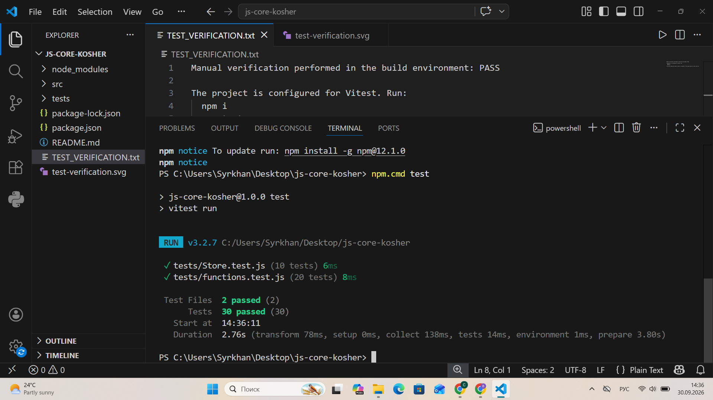

# js-core-kosher

## Lab 4 — JavaScript Core

**Student:** Көшер Сырхан  
**Repository:** `js-core-kosher`

### Topic

JavaScript functions, closures, classes, inheritance and unit tests.

### Project structure

```text
js-core-kosher/
├── src/
│   ├── functions.js
│   └── Store.js
├── tests/
│   ├── functions.test.js
│   └── Store.test.js
├── package.json
└── README.md
```

## How to run the tests

Install dependencies:

```bash
npm i
```

Run all unit tests:

```bash
npm test
```

All tests should finish with a green result.

## What was implemented

### Part 1 — Functions

- `unique(arr)` — removes duplicate values.
- `groupBy(arr, keyFn)` — groups items by a calculated key.
- `chunk(arr, size)` — splits an array into chunks.
- `deepClone(obj)` — creates a deep copy without JSON serialization.
- `memoize(fn)` — caches function results using a closure.
- `counter()` — returns `inc`, `dec` and `value` functions that share private state through a closure.

The implementation uses higher-order functions and JavaScript features such as `map`, `filter`, `reduce`, destructuring and spread syntax.

### Part 2 — Store class

`Store` contains:

- `add()`
- `remove()`
- `find()`
- `total()`
- private field `#items`
- getters `items` and `count`
- static method `Store.from()`

`SortedStore` extends `Store`, overrides `find()` and calls `super.find()` before sorting the result.

### Part 3 — Unit tests

The project uses **Vitest** and contains more than 12 tests. The tests cover normal cases and edge cases such as empty arrays, zero values and wrong input types.

## Closures in my code

I used closures in the `memoize` and `counter` functions. A closure allows an inner function to remember variables from the outer function. In `counter`, the current value is stored inside the closure, so `inc`, `dec` and `value` can use the same private state. In `memoize`, the closure stores calculated results in a cache. When the function receives the same arguments again, it can return the saved result instead of calculating it again. This shows how closures can keep state between function calls without making that state global.

## AI tools used

I used **ChatGPT** to help understand the assignment requirements, structure the project and review the JavaScript code. I can explain the functions, closures, classes and tests used in this project.

## Test screenshot


After running `npm test`, all tests pass:


